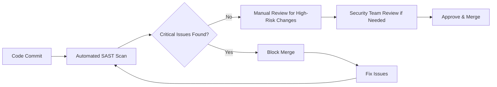

**Secure code review** is one of the most effective ways to identify and fix security vulnerabilities before they reach production. In my experience as an application security engineer, I've seen organizations reduce their vulnerability count by up to 80% simply by implementing proper secure code review processes.

This comprehensive guide will walk you through implementing secure code reviews in your Software Development Life Cycle (SDLC), from establishing processes to using the right tools and metrics.

## Why Secure Code Review Matters

### The Cost of Late Detection

The cost of fixing security issues increases exponentially as they progress through the development lifecycle:

- **Design Phase**: $1 to fix
- **Development Phase**: $10 to fix
- **Testing Phase**: $100 to fix
- **Production Phase**: $1,000+ to fix

### Benefits of Early Detection

1. **Reduced Security Debt**: Catch issues before they accumulate
2. **Developer Education**: Learn secure coding practices through reviews
3. **Compliance Requirements**: Meet regulatory standards
4. **Risk Mitigation**: Prevent data breaches and security incidents

## Types of Code Review

### 1. Manual Security Code Review

**When to Use**: Complex business logic, custom authentication, critical components

**Benefits**:
- Deep understanding of context and business logic
- Identification of logic flaws and design issues
- Custom vulnerability detection

**Example Checklist**:
```markdown
## Authentication & Authorization
- [ ] Password complexity requirements implemented
- [ ] Session management secure
- [ ] Access controls properly enforced
- [ ] Multi-factor authentication where required

## Input Validation
- [ ] All inputs validated server-side
- [ ] Parameterized queries used
- [ ] File upload restrictions implemented
- [ ] Data sanitization performed

## Error Handling
- [ ] No sensitive information in error messages
- [ ] Proper logging implemented
- [ ] Graceful error handling
- [ ] Security events logged
```

### 2. Automated Security Code Review (SAST)

**When to Use**: Every code commit, comprehensive coverage, compliance requirements

**Popular Tools**:

| Tool | Language Support | Key Features |
|------|------------------|--------------|
| SonarQube | 25+ languages | Free community edition, IDE integration |
| Checkmarx | 20+ languages | Comprehensive reporting, compliance support |
| Veracode | 20+ languages | Cloud-based, accurate results |
| Semgrep | 15+ languages | Open source, custom rules |

### 3. Hybrid Approach (Recommended)

Combine automated and manual reviews for maximum effectiveness:



## Implementing Secure Code Review Process

### Phase 1: Foundation (Week 1-2)

#### 1. Establish Security Coding Standards

Create comprehensive guidelines covering:

**Input Validation Standards**:
```python
# Good: Proper input validation
def process_user_input(user_input):
    # Validate input length
    if len(user_input) > 100:
        raise ValueError("Input too long")
    
    # Validate input format
    if not re.match(r'^[a-zA-Z0-9\s]+$', user_input):
        raise ValueError("Invalid characters")
    
    # Sanitize input
    sanitized_input = html.escape(user_input)
    return sanitized_input.strip()

# Bad: No validation
def process_user_input(user_input):
    return user_input  # Direct use without validation
```

#### 2. Set Up Tool Integration

**GitHub Integration Example**:
```yaml
# .github/workflows/security-scan.yml
name: Security Scan
on: [push, pull_request]

jobs:
  security-scan:
    runs-on: ubuntu-latest
    steps:
    - uses: actions/checkout@v2
    - name: Run Semgrep
      uses: returntocorp/semgrep-action@v1
      with:
        config: auto
    - name: SonarQube Scan
      uses: sonarqube-quality-gate-action@master
      env:
        SONAR_TOKEN: ${{ secrets.SONAR_TOKEN }}
```

### Phase 2: Team Training (Week 3-4)

#### Security Training Curriculum

1. **Week 1**: OWASP Top 10 Overview
2. **Week 2**: Secure Coding Practices
3. **Week 3**: Code Review Techniques
4. **Week 4**: Tool Usage and Integration

#### Hands-On Workshops

Create practical exercises:

```python
# Workshop Exercise: Fix the Security Issues
def authenticate_user(username, password):
    # Issue 1: SQL Injection vulnerability
    query = f"SELECT * FROM users WHERE username = '{username}' AND password = '{password}'"
    result = db.execute(query)
    
    # Issue 2: Information disclosure
    if not result:
        return {"status": "failed", "message": f"User {username} not found or wrong password"}
    
    # Issue 3: Password comparison timing attack
    if result[0]['password'] == password:
        return {"status": "success", "user": result[0]}
    
    return {"status": "failed", "message": "Authentication failed"}

# Solution: Secure implementation
def authenticate_user(username, password):
    # Fix 1: Use parameterized queries
    query = "SELECT id, username, password_hash FROM users WHERE username = %s"
    result = db.execute(query, (username,))
    
    if not result:
        # Fix 2: Generic error message
        return {"status": "failed", "message": "Invalid credentials"}
    
    user = result[0]
    # Fix 3: Use constant-time comparison
    if bcrypt.checkpw(password.encode('utf-8'), user['password_hash']):
        return {"status": "success", "user_id": user['id']}
    
    return {"status": "failed", "message": "Invalid credentials"}
```

### Phase 3: Process Integration (Week 5-6)

#### Define Review Triggers

**Automated Triggers**:
- Every pull request
- Code touching security-critical paths
- Changes to authentication/authorization logic
- External library updates

**Manual Review Triggers**:
- Cryptographic implementations
- Payment processing code
- Admin functionality
- Data export/import features

#### Review Workflow

```python
# Example: Security-critical path detection
SECURITY_CRITICAL_PATHS = [
    '/auth/',
    '/admin/',
    '/payment/',
    '/crypto/',
    'authentication.py',
    'authorization.py'
]

def requires_security_review(changed_files):
    """Determine if changes require security review"""
    for file_path in changed_files:
        for critical_path in SECURITY_CRITICAL_PATHS:
            if critical_path in file_path:
                return True
    return False
```

## Security Review Checklist

### General Security Principles

```markdown
## Authentication & Session Management
- [ ] Strong authentication mechanisms implemented
- [ ] Session IDs are randomly generated and properly invalidated
- [ ] Account lockout mechanisms prevent brute force attacks
- [ ] Password policies enforce complexity requirements

## Input Validation & Data Handling
- [ ] All inputs validated on server-side
- [ ] Parameterized queries prevent SQL injection
- [ ] File uploads restricted and validated
- [ ] Data encoding prevents XSS attacks

## Access Control
- [ ] Principle of least privilege enforced
- [ ] Authorization checks on all sensitive operations
- [ ] Direct object references protected
- [ ] Admin functions properly secured

## Error Handling & Logging
- [ ] Sensitive information not exposed in error messages
- [ ] Security events properly logged
- [ ] Log injection prevented
- [ ] Error handling doesn't reveal system information

## Cryptography
- [ ] Strong encryption algorithms used (AES-256, RSA-2048+)
- [ ] Secure random number generation
- [ ] Proper key management
- [ ] No hardcoded cryptographic keys

## Configuration & Deployment
- [ ] Secure default configurations
- [ ] Debug mode disabled in production
- [ ] Unnecessary features and services disabled
- [ ] Security headers properly implemented
```

### Language-Specific Checks

**Python Security Checks**:
```python
# Check for common Python security issues

# 1. SQL Injection Prevention
# Bad
cursor.execute("SELECT * FROM users WHERE id = " + user_id)

# Good
cursor.execute("SELECT * FROM users WHERE id = %s", (user_id,))

# 2. Command Injection Prevention
# Bad
os.system("rm " + filename)

# Good
subprocess.run(["rm", filename], check=True)

# 3. Path Traversal Prevention
# Bad
with open("uploads/" + filename, 'r') as f:
    return f.read()

# Good
safe_filename = os.path.basename(filename)
safe_path = os.path.join("uploads", safe_filename)
if not safe_path.startswith("uploads/"):
    raise ValueError("Invalid filename")
with open(safe_path, 'r') as f:
    return f.read()
```

## Tools and Automation

### SAST Tool Comparison

| Criteria | SonarQube | Checkmarx | Veracode | Semgrep |
|----------|-----------|-----------|----------|---------|
| **Cost** | Free/Paid | Paid | Paid | Free/Paid |
| **Accuracy** | Good | Excellent | Excellent | Good |
| **Language Support** | 25+ | 20+ | 20+ | 15+ |
| **CI/CD Integration** | Excellent | Good | Good | Excellent |
| **Custom Rules** | Limited | Yes | Limited | Excellent |
| **Learning Curve** | Low | Medium | Medium | Low |

### Setting Up SonarQube

**Docker Installation**:
```bash
# docker-compose.yml
version: '3'
services:
  sonarqube:
    image: sonarqube:community
    ports:
      - "9000:9000"
    environment:
      - SONAR_ES_BOOTSTRAP_CHECKS_DISABLE=true
    volumes:
      - sonarqube_data:/opt/sonarqube/data
      - sonarqube_extensions:/opt/sonarqube/extensions
      - sonarqube_logs:/opt/sonarqube/logs

volumes:
  sonarqube_data:
  sonarqube_extensions:
  sonarqube_logs:
```

**Project Configuration**:
```properties
# sonar-project.properties
sonar.projectKey=my-secure-app
sonar.projectName=My Secure Application
sonar.projectVersion=1.0

# Source directories
sonar.sources=src
sonar.tests=tests

# Language-specific settings
sonar.python.coverage.reportPaths=coverage.xml
sonar.security.hotspots.new_code_period=30d
```

## Metrics and KPIs

### Security Metrics to Track

1. **Vulnerability Detection Rate**
   ```
   Detection Rate = (Vulnerabilities Found in Review / Total Vulnerabilities) * 100
   ```

2. **Mean Time to Fix (MTTF)**
   ```
   MTTF = Total Time to Fix All Issues / Number of Issues Fixed
   ```

3. **Security Debt**
   ```
   Security Debt = Number of Outstanding Security Issues * Average Fix Time
   ```

4. **Review Coverage**
   ```
   Coverage = (Lines of Code Reviewed / Total Lines of Code) * 100
   ```

### Reporting Dashboard Example

```python
# Example: Security metrics collection
class SecurityMetrics:
    def __init__(self):
        self.db = SecurityMetricsDB()
    
    def calculate_detection_rate(self, period='30d'):
        found_in_review = self.db.get_vulnerabilities_found_in_review(period)
        total_vulnerabilities = self.db.get_total_vulnerabilities(period)
        return (found_in_review / total_vulnerabilities) * 100 if total_vulnerabilities > 0 else 0
    
    def calculate_mean_time_to_fix(self, period='30d'):
        fixed_issues = self.db.get_fixed_issues(period)
        if not fixed_issues:
            return 0
        
        total_time = sum(issue['fix_time'] for issue in fixed_issues)
        return total_time / len(fixed_issues)
    
    def get_security_trends(self, period='90d'):
        return {
            'new_issues': self.db.get_new_issues_count(period),
            'fixed_issues': self.db.get_fixed_issues_count(period),
            'critical_issues': self.db.get_critical_issues_count(period),
            'review_coverage': self.calculate_review_coverage(period)
        }
```

## Advanced Techniques

### Custom Security Rules

**Semgrep Custom Rule Example**:
```yaml
# rules/custom-security.yml
rules:
  - id: hardcoded-api-key
    pattern: |
      api_key = "..."
    message: |
      Hardcoded API key detected. Use environment variables or secure vaults.
    languages: [python]
    severity: ERROR
    
  - id: unsafe-deserialization
    pattern: |
      pickle.loads(...)
    message: |
      Unsafe deserialization detected. Use safe alternatives like json.loads()
    languages: [python]
    severity: WARNING
```

### Threat Modeling Integration

Integrate threat modeling results into code review:

```python
# Example: Threat model integration
THREAT_MODEL_CONTROLS = {
    'authentication': [
        'password_complexity_check',
        'account_lockout_mechanism',
        'session_timeout'
    ],
    'authorization': [
        'role_based_access_control',
        'object_level_authorization',
        'api_rate_limiting'
    ],
    'data_protection': [
        'encryption_at_rest',
        'encryption_in_transit',
        'data_classification'
    ]
}

def verify_threat_controls(code_changes, affected_components):
    """Verify that required threat model controls are implemented"""
    missing_controls = []
    
    for component in affected_components:
        required_controls = THREAT_MODEL_CONTROLS.get(component, [])
        for control in required_controls:
            if not is_control_implemented(code_changes, control):
                missing_controls.append(f"{component}: {control}")
    
    return missing_controls
```

## Common Pitfalls and Solutions

### Pitfall 1: Review Fatigue

**Problem**: Reviewers become overwhelmed with security findings

**Solution**:
- Prioritize critical and high-severity issues
- Implement progressive disclosure in tools
- Rotate review responsibilities

### Pitfall 2: False Positives

**Problem**: Too many false positive findings reduce trust

**Solution**:
```python
# Example: False positive management
class FalsePositiveManager:
    def __init__(self):
        self.suppression_rules = self.load_suppression_rules()
    
    def is_false_positive(self, finding):
        """Check if finding matches known false positive patterns"""
        for rule in self.suppression_rules:
            if self.matches_rule(finding, rule):
                return True
        return False
    
    def suppress_finding(self, finding, justification):
        """Add finding to suppression list with justification"""
        suppression_rule = {
            'pattern': finding.pattern,
            'file_path': finding.file_path,
            'justification': justification,
            'created_by': finding.reviewer,
            'created_date': datetime.now()
        }
        self.suppression_rules.append(suppression_rule)
        self.save_suppression_rules()
```

### Pitfall 3: Lack of Context

**Problem**: Automated tools miss business logic context

**Solution**: Implement contextual analysis

```python
# Example: Business context integration
class BusinessContextAnalyzer:
    def __init__(self):
        self.business_rules = self.load_business_rules()
    
    def analyze_context(self, code_change, metadata):
        """Analyze code change in business context"""
        context = {
            'component': metadata.get('component'),
            'data_classification': metadata.get('data_classification'),
            'user_roles': metadata.get('affected_user_roles'),
            'compliance_requirements': metadata.get('compliance')
        }
        
        # Apply business-specific security rules
        violations = []
        for rule in self.business_rules:
            if rule.applies_to(context) and rule.is_violated_by(code_change):
                violations.append(rule.get_violation_message())
        
        return violations
```

## Conclusion

Implementing secure code review in your SDLC is a journey, not a destination. Start with the basics—establish standards, integrate tools, and train your team. As your security maturity grows, add advanced techniques like custom rules and threat model integration.

### Key Success Factors:

1. **Leadership Support**: Ensure management backs security initiatives
2. **Developer Buy-in**: Make security review part of the culture
3. **Continuous Improvement**: Regularly evaluate and improve processes
4. **Proper Tooling**: Invest in tools that fit your workflow
5. **Metrics-Driven**: Use data to demonstrate value and identify improvements

### Next Steps:

1. **Assess Current State**: Evaluate your existing code review process
2. **Pilot Program**: Start with a small team or project
3. **Gradual Rollout**: Expand to more teams as processes mature
4. **Continuous Monitoring**: Track metrics and adjust as needed

Remember: The goal isn't to find every possible security issue, but to significantly improve your security posture while maintaining development velocity. A good secure code review process should make developers more security-aware and confident in their code.

---

*Interested in implementing secure code review in your organization? [Contact me](/contact/) for consulting services or check out my [training workshops](/speaking) on secure development practices.*